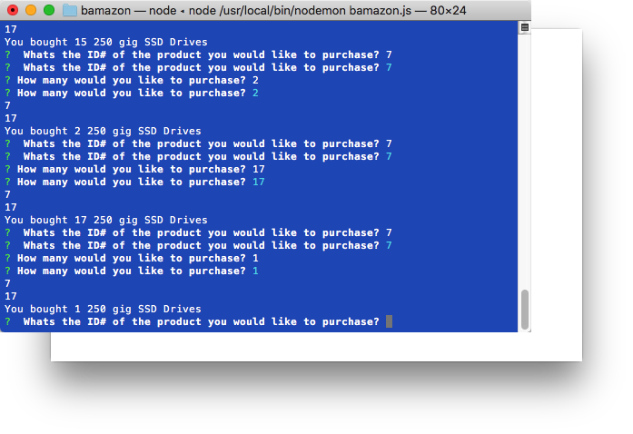

# bamazonWelcome to Bamazon!
This CLI application uses Node.js and MySQL to emulate an online shopping experience.
How to Install and Run the Application
Install the app by cloning this repo and navigating to the file in the command line.
Remember to npm install so the dependencies are loaded to your local copy of the app.
Create a database using MySQL called Bamazon. Use the code in the bamazonSchema.sql file to populate your Bamazon database with tables and some inventory. (Use Workbench, Sequel Pro or MySQL in the command line).
There is one dashboard to this application - Customer View. Run the application by typing node bamazonCustomer.js in the command line. Two new dashboards are coming soon.
Follow the prompts to Make Bamazon Purchases.

